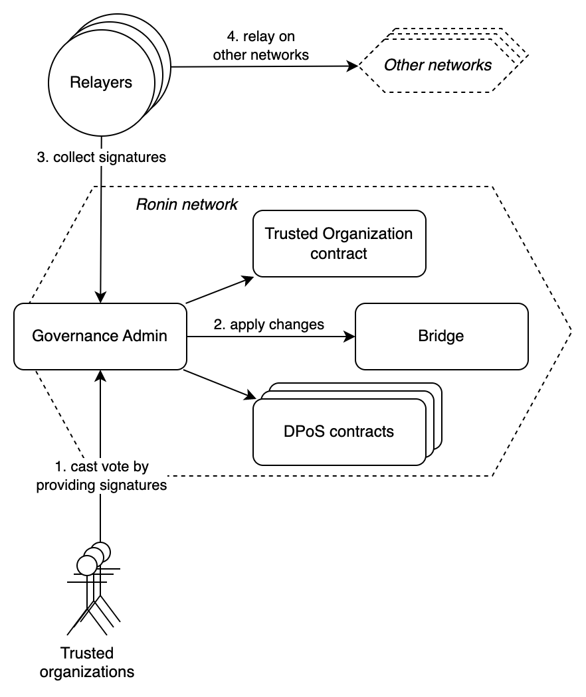
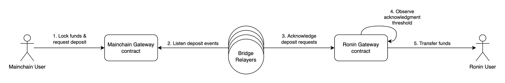
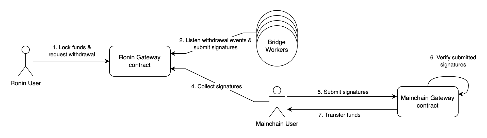

# Ronin DPoS Contracts

The collections of smart contracts that power the Ronin Delegated Proof of Stake (DPoS) network.

Read more details at the [Ronin Whitepaper](https://www.notion.so/skymavis/Ronin-Whitepaper-deec289d6cec49d38dc6e904669331a5).

- [Overview](#ronin-dpos-contracts)
  - [Governance](#governance)
    - [Ronin Trusted Organization](#ronin-trusted-organization)
    - [Bridge Operators Ballot](#bridge-operators-ballot)
    - [Proposals](#proposals)
  - [Staking](#staking)
    - [Validator Candidate](#validator-candidate)
    - [Delegator](#delegator)
    - [Reward Calculation](#reward-calculation)
  - [Validator Contract & Rewarding](#validator-contract--rewarding)
    - [Block reward submission](#block-reward-submission)
    - [Wrapping up epoch/period](#wrapping-up-epochperiod)
  - [Slashing](#slashing)
    - [Unavailability block producer](#unavailability-block-producer)
    - [Double-sign block producer](#double-sign-block-producer)
    - [Bridge Relayers](#bridge-relayers)
    - [Bridge Voters (Ronin Trusted Organizations)](#bridge-voters-ronin-trusted-organizations)
    - [Credit score](#credit-score)
  - [Maintenance](#maintenance)
  - [Bridges](#bridges)
    - [Deposits](#deposits)
    - [Withdrawals](#withdrawals)
  - [Contract Interaction flow](#contract-interaction-flow)
- [Development](#development)
    - [Requirement](#requirement)
    - [Compile & test](#compile--test)
- [Deployment](#deployment)

## Governance

We have a group of trusted organizations that are chosen by the community and Sky Mavis. Their tasks are to take part in the Validator set and govern the network configuration through the on-chain governance process:

- Update the system parameters, e.g: slash thresholds, and add/remove trusted organizations,...
- Sync the set of bridge operators to the Ethereum chain every period.


_Governance flow overview_

The governance contracts (`RoninGovernanceAdmin` and `MainchainGovernanceAdmin`) are mainly responsible for the governance process via a decentralized voting mechanism. At any instance, there will be maximum one governance vote going on per network.

### Ronin Trusted Organization

| Properties              | Explanation                                                                        |
| ----------------------- | ---------------------------------------------------------------------------------- |
| `address consensusAddr` | Address of the validator that produces block. This is so-called validator address. |
| `address governor`      | Address to voting proposal                                                         |
| `address bridgeVoter`   | Address to voting bridge operators                                                 |
| `uint256 weight`        | Governor weight                                                                    |

### Bridge Operators Ballot

```js
// keccak256("BridgeOperatorsBallot(uint256 period,address[] operators)");
const TYPEHASH = 0xeea5e3908ac28cbdbbce8853e49444c558a0a03597e98ef19e6ff86162ed9ae3;
```

| Name        | Type        | Explanation                                |
| ----------- | ----------- | ------------------------------------------ |
| `period`    | `uint256`   | The period that these operators are active |
| `operators` | `address[]` | The address list of all operators          |

### Proposals

**Per-chain Proposal**

```js
// keccak256("ProposalDetail(uint256 nonce,uint256 chainId,address[] targets,uint256[] values,bytes[] calldatas,uint256[] gasAmounts)");
const TYPE_HASH = 0x65526afa953b4e935ecd640e6905741252eedae157e79c37331ee8103c70019d;
```

| Name         | Type        | Explanation                                                   |
| ------------ | ----------- | ------------------------------------------------------------- |
| `nonce`      | `uint256`   | The proposal nonce                                            |
| `chainId`    | `uint256`   | The chain id to execute the proposal (id = 0 for all network) |
| `targets`    | `address[]` | List of address that the BridgeAdmin has to call              |
| `values`     | `uint256[]` | msg.value to send for targets                                 |
| `calldatas`  | `bytes[]`   | Data to call to the targets                                   |
| `gasAmounts` | `uint256[]` | Gas amount to call                                            |

**Global Proposal**

The governance has 2 target options to call to globally:

- Option 0: `RoninTrustedOrganization` contract
- Option 1: `Bridge` contract

```js
// keccak256("GlobalProposalDetail(uint256 nonce,uint8[] targetOptions,uint256[] values,bytes[] calldatas,uint256[] gasAmounts)");
const TYPE_HASH = 0xdb316eb400de2ddff92ab4255c0cd3cba634cd5236b93386ed9328b7d822d1c7;
```

| Name            | Type        | Explanation                   |
| --------------- | ----------- | ----------------------------- |
| `nonce`         | `uint256`   | The proposal nonce            |
| `targetOptions` | `uint8[]`   | List of options               |
| `values`        | `uint256[]` | msg.value to send for targets |
| `calldatas`     | `bytes[]`   | Data to call to the targets   |
| `gasAmounts`    | `uint256[]` | Gas amount to call            |

## Staking

The users can propose themselves to be validator candidates by staking their RON. Other users are allowed to register as delegators by staking any amount of RON to the staking contract, (s)he can choose a candidate to stake their coins.

### Validator Candidate

**Applying to be a candidate**

| Params                       | Explanation                                                                                                                                         |
| ---------------------------- | --------------------------------------------------------------------------------------------------------------------------------------------------- |
| `address candidateAdmin`     | The candidate admin will be stored in the validator contract, used for calling function that affects to its candidate, e.g. scheduling maintenance. |
| `address consensusAddr`      | Address to produce block                                                                                                                            |
| `address treasuryAddr`       | Address to receive block reward                                                                                                                     |
| `address bridgeOperatorAddr` | Address of the bridge operator                                                                                                                      |
| `uint256 commissionRate`     | The rate to share for the validator. Values in range [0; 100_00] stands for [0; 100%]                                                               |
| `msg.value`                  | The amount of RON to stake, require to be larger than or equal to the threshold `minValidatorStakingAmount()` to be validator                       |

The validator candidates can deposit or withdraw their funds afterwards as long as the staking balance must be greater than the threshold `minValidatorStakingAmount()`.

**Renouncing**

The candidates can renounce and take back their deposited RON at the next period ending after waiting `waitingSecsToRevoke()` seconds.

### Delegator

The delegator can choose the validator to stake and receive the commission reward:

| Methods                                                  | Explanation                                                                        |
| -------------------------------------------------------- | ---------------------------------------------------------------------------------- |
| `delegate(consensusAddr)`                                | Stakes `msg.value` amount of RON for a validator `consensusAddr`                   |
| `undelegate(consensusAddr, amount)`                      | Unstakes from a validator                                                          |
| `redelegate(consensusAddrSrc, consensusAddrDst, amount)` | Unstakes `amount` RON from the `consensusAddrSrc` and stake for `consensusAddrDst` |
| `getRewards(consensusAddrList)`                          | Returns all of the claimable rewards                                               |
| `claimRewards(consensusAddrList)`                        | Claims all the reward from the validators                                          |
| `delegateRewards(consensusAddrList, consensusAddr)`      | Claims all the reward and delegates them to the consensus address                  |

The delegator has to wait at least `cooldownSecsToUndelegate()` seconds from the last timestamp (s)he delegated before undelegating.

### Reward Calculation

The reward is calculated based on the minimum staking amount in the current period of a specific delegator:

- Read how the reward is calculated for delegator at [Staking Problem: Reward Calculation](https://skymavis.notion.site/Staking-Problem-Reward-Calculation-bd47bbcefde24bbd8e959bee45dfd4a5).
- See [`RewardCalculation` contract](./contracts/ronin/staking/RewardCalculation.sol) for the implementation.

## Validator Contract & Rewarding

The top users with the highest amount of staked coins will be considered to be validators after prioritizing the trusted organizations. The total number of validators do not larger than `maxValidatorNumber()`. Each validator will be a block producer and a bridge relayer, whenever a validator gets jailed its corresponding block producer will not be able to receive the block reward.

### Block reward submission

The block miners submit their block reward at the end of each block, and these amounts will be split for the block producers and their corresponding delegators at the end of the period (~1 day).

### Wrapping up epoch/period


_Validator contract flow overview_

1. The block producer calls the contract `RoninValidatorSet.wrapUpEpoch()` to filter jailed/maintaining block producers.

At the end of each period, the contract:

2. Distributes mining reward and bridge relaying reward for the current validators.
3. Updates credit scores in the contract `SlashIndicator`.
4. Syncs the new validator set by using to precompiled contract.

## Slashing

The validators will be slashed when they do not provide good service for Ronin network.

### Unavailability block producer

| Properties                                    | Explanation                                                                                                                                    |
| --------------------------------------------- | ---------------------------------------------------------------------------------------------------------------------------------------------- |
| `unavailabilityTier1Threshold`                | The mining reward will be deprecated, if (s)he missed more than this threshold.                                                                |
| `unavailabilityTier2Threshold`                | The mining reward will be deprecated, (s)he will be put in jailed, and will be deducted self-staking if (s)he misses more than this threshold. |
| `slashAmountForUnavailabilityTier2Threshold`  | The amount of RON to deduct from self-staking of a block producer when (s)he is slashed tier-2.                                                |
| `jailDurationForUnavailabilityTier2Threshold` | The number of blocks to jail a block producer when (s)he is slashed tier-2.                                                                    |

### Double-sign block producer

| Properties                    | Explanation                                                                               |
| ----------------------------- | ----------------------------------------------------------------------------------------- |
| `slashDoubleSignAmount`       | The amount of RON to slash double sign.                                                   |
| `doubleSigningJailUntilBlock` | The block number that the punished validator will be jailed until, due to double signing. |

### Bridge Relayers

| Properties                              | Explanation                                                                                                                                           |
| --------------------------------------- | ----------------------------------------------------------------------------------------------------------------------------------------------------- |
| `missingVotesRatioTier1`                | The bridge reward will be deprecated if (s)he missed more than this ratio.                                                                            |
| `missingVotesRatioTier2`                | The bridge reward and mining reward will be deprecated and the corresponding block producer will be put in jail if (s)he misses more than this ratio. |
| `jailDurationForMissingVotesRatioTier2` | The number of blocks to jail the corresponding block producer when its bridge operator is slashed tier-2.                                             |

### Bridge Voters (Ronin Trusted Organizations)

| Properties                | Explanation                                                                            |
| ------------------------- | -------------------------------------------------------------------------------------- |
| `bridgeVotingThreshold`   | The threshold to slash when a trusted organization does not vote for bridge operators. |
| `bridgeVotingSlashAmount` | The amount of RON to slash bridge voting.                                              |

### Credit score

| Properties                     | Explanation                                                                                                          |
| ------------------------------ | -------------------------------------------------------------------------------------------------------------------- |
| `gainCreditScore`              | The max gained number of credit score per period.                                                                    |
| `maxCreditScore`               | The max number of credit score that a validator can hold.                                                            |
| `bailOutCostMultiplier`        | The number that will be multiplied with the remaining jailed time to get the cost of bailing out.                    |
| `cutOffPercentageAfterBailout` | The percentage of reward that the block producer will be cut off from until the end of the period after bailing out. |

## Maintenance

The validators will be slashed in their absence (even when it is due to scheduled maintenance). We allow the validators scheduling to enter a maintenance mode:

| Properties                      | Explanation                                                     |
| ------------------------------- | --------------------------------------------------------------- |
| `minMaintenanceDurationInBlock` | The min duration to maintenance in blocks.                      |
| `maxMaintenanceDurationInBlock` | The max duration to maintenance in blocks.                      |
| `minOffsetToStartSchedule`      | The offset to the min block number that the schedule can start. |
| `maxOffsetToStartSchedule`      | The offset to the max block number that the schedule can start. |
| `maxSchedules`                  | The max number of scheduled maintenances.                       |

## Bridges

The bridge is design to support multiple chains.
When a deposit event happens on mainchain, the Bridge component in each validator node will pick it up and relay it to Ronin by sending a corresponding transaction. For withdrawal and governance events, it will start from Ronin then being relay on other chains.

### Deposits

Users can deposit ETH, ERC20, and ERC721 (NFTs) by sending transactions to `MainchainGatewayV2` and waiting for the deposit to be verified on Ronin. The validator will listen to the event on mainchain and then acknowledge the deposit on Ronin. The gateway should have a mapping between token contracts on Ethereum and on Ronin before the deposit can take place.

For deposit there is no restriction on how large a deposit can be.


### Withdrawals

For withdrawal there are certain restrictions:

1. Withdrawal tiers

   There are 3 withdrawal tiers with different level of threshold required to withdraw. This is what we propose initially

   | Tier   | Withdrawal Value | Threshold                                                                                               |
   | ------ | :--------------: | ------------------------------------------------------------------------------------------------------- |
   | Tier 1 |        -         | The normal withdrawal/deposit threshold                                                                 |
   | Tier 2 |      >= $1M      | Applied the special threshold for high-tier withdrawals                                                 |
   | Tier 3 |     >= $10M      | Applied the special threshold for high-tier withdrawals, one additional human review to unlock the fund |

2. Daily withdrawal limit

   There will be another constraint on the number of token that can be withdraw in a day. We propose to cap the value at $50M. Since withdrawal of Tier 3 already requires human review, it will not be counted in daily withdrawal limit.


_Normal withdrawal flow (tier 1 + tier 2). For tier 3, a separated human address will need to unlock the fund._

## Contract Interaction flow

Read the contract interaction flow at [DPoS Contract: Interaction Flow](https://skymavis.notion.site/DPoS-Contract-Interaction-Flow-3a535cf9048f46f69dd9a45958ad9b85).

# Development

### Requirement

- Node@>=14 + Solc@^0.8.0

### Compile & test

```shell
$ yarn install
$ yarn compile
$ yarn test
```

# Deployment

On main chains, we need to deploy the governance contract and bridge contracts: `RoninTrustedOrganization`, `MainchainGovernanceAdmin` and `MainchainGatewayV2`.

On Ronin we deploy `RoninGatewayV2` for bridge operation and the DPoS contracts.

All contracts (except governance contracts) are upgradable by following the governance process, we use [`TransparentUpgradeableProxy`](https://docs.openzeppelin.com/contracts/3.x/api/proxy#TransparentUpgradeableProxy) for this use case, and they should grant the governance contract the role of admin.

Here is the deployment steps:

- Init the environment variables:

```shell
$ cp .env.example .env && vim .env
```

- Update the contract configuration in [`config.ts`](./src/config.ts) file

- Deploy the contracts:

```shell
$ yarn hardhat deploy --network <local|ronin-devnet|ronin-mainnet|ronin-testnet>
```
